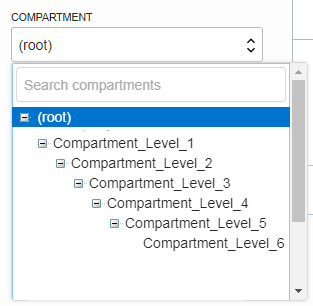

# Oracle Cloud Infrastructure (OCI) Terraform IAM Compartments Module

## Introduction

This module assist in provisioning OCI Compartments.  

## Solution

The module covers the following use cases:

* Creating one or multiple compartments.
* Creating up to 6(OCI limit) hierarchical(one to another) compartments
  *  

Multiple combinations between the use cases above are possible/supported.

## Prerequisites
This module does not create any dependencies or prerequisites. 

Create the following before using this module: 
  * Required IAM construct to allow for the creation of resources

## Getting Started

A fully-functional example is provided in the `examples` directory.  

The following scenarios are covered in the examples:
* Creating a single compartment
* Provision up to 6(OCI limit) hierarchical(one to another) Compartments.


## Accessing the Solution

This is a core service module that is foundational to many other resources in OCI, so there is really nothing to directly access.


## Module inputs

### Provider

This module supports a custom provider. With a custom provider, IAM resources must be deployed in your home tenancy, which might be different from the region that will contain other deployments. 

You'll be managing those providers in the tf automation projects where you reference this module.

In the examples sections we're querying the home region by using the default provider and, in this way, calculating the home region provider.

Example:

```
provider "oci" {
  tenancy_ocid     = "${var.tenancy_id}"
  user_ocid        = "${var.user_id}"
  fingerprint      = "${var.fingerprint}"
  private_key_path = "${var.private_key_path}"
  region           = "${var.region}"
}

provider "oci" {
  alias            = "home"
  tenancy_ocid     = "${var.tenancy_id}"
  user_ocid        = "${var.user_id}"
  fingerprint      = "${var.fingerprint}"
  private_key_path = "${var.private_key_path}"
  region           = [for i in data.oci_identity_region_subscriptions.this.region_subscriptions : i.region_name if i.is_home_region == true][0]
}

data "oci_identity_region_subscriptions" "this" {
  tenancy_id = var.tenancy_id
}

```

The following IAM attributes are available in the the `terraform.tfvars` file:

```
### PRIMARY TENANCY DETAILS

# Get this from the bottom of the OCI screen (after logging in, after Tenancy ID: heading)
primary_tenancy_id="<tenancy OCID"
# Get this from OCI > Identity > Users (for your user account)
primary_user_id="<user OCID>"

# the fingerprint can be gathered from your user account (OCI > Identity > Users > click your username > API Keys fingerprint (select it, copy it and paste it below))
primary_fingerprint="<PEM key fingerprint>"
# this is the full path on your local system to the private key used for the API key pair
primary_private_key_path="<path to the private key that matches the fingerprint above>"

# region (us-phoenix-1, ca-toronto-1, etc)
primary_region="<your region>"

### DR TENANCY DETAILS

# Get this from the bottom of the OCI screen (after logging in, after Tenancy ID: heading)
dr_tenancy_id="<tenancy OCID"
# Get this from OCI > Identity > Users (for your user account)
dr_user_id="<user OCID>"

# the fingerprint can be gathered from your user account (OCI > Identity > Users > click your username > API Keys fingerprint (select it, copy it and paste it below))
dr_fingerprint="<PEM key fingerprint>"
# this is the full path on your local system to the private key used for the API key pair
dr_private_key_path="<path to the private key that matches the fingerprint above>"

# region (us-phoenix-1, ca-toronto-1, etc)
dr_region="<your region>"
```


### Compartments

A compartment resources(object) specifies the  attributes for a compartment, including the parent compartment.

**`oci_identity_compartment.compartments`**

| Attribute | Data Type | Required | Default Value | Valid Values | Description |
|---|---|---|---|---|---|
| provider | string | yes | "oci.oci_home"| string containing the name of the provider as defined by the automation that consumes this module | See the examples section in order to understand how to set the provider|
| for_each | map | yes | 0 | the resources to be created | the resources to be created |
| name | string | yes | "OCI-TF-Group" | string of the display name | Resource name |
| compartment\_id | string | yes | none | string of the parent compartment OCID | This is the OCID of the parent compartment |
| description | string | no | N/A (no default) | The provided description |
| define\_tags | map(string) | no | N/A (no default) | The defined tags.
| freeform\_tags| map(string) | no | N/A (no default) | The freeform\_tags.


***Example***

The following example will create 2 compartments, each with one subcompartment:

```
# Compartments config Variable

compartments_config_1 = {
  default_compartment_id = "ocid1.tenancy.oc1..aaaaaaaaxzpxbcag7zgamh2erlggqro3y63tvm2rbkkjz4z2zskvagupiz7a"
  default_defined_tags   = {}
  default_freeform_tags  = null
  compartments = {
    l1_c1 = {
      description    = "Test Compartment 1"
      compartment_id = "ocid1.tenancy.oc1..aaaaaaaaxzpxbcag7zgamh2erlggqro3y63tvm2rbkkjz4z2zskvagupiz7a"
      defined_tags   = null
      freeform_tags  = null
      enable_delete  = true
      sub_compartments = {
        l1_c1_l2_c1 = {
          description      = "Test Compartment l1_c1_l2_c1"
          defined_tags     = null
          freeform_tags    = null
          enable_delete    = true
          sub_compartments = {}
        }
      }
    }
    l1_c2 = {
      description    = "Test Compartment l_c21"
      compartment_id = "ocid1.tenancy.oc1..aaaaaaaaxzpxbcag7zgamh2erlggqro3y63tvm2rbkkjz4z2zskvagupiz7a"
      defined_tags   = {}
      freeform_tags  = {}
      enable_delete  = true
      sub_compartments = {
        l1_c2_l2_c1 = {
          description      = "Test Compartment l1_c2_l2_c1"
          defined_tags     = null
          freeform_tags    = null
          enable_delete    = true
          sub_compartments = {}
        }
      }
    }
  }
}

```


## Outputs

This module is returning 1 map of objects:
* `compartments_config`: Contains the details about each provisioned Compartment and the tenancy home region


## Notes/Issues


## URLs

* OCI IAM Dynamic Groups documentation: 
  * https://docs.cloud.oracle.com/iaas/Content/Identity/Tasks/managingdynamicgroups.htm

## Versions

This module has been developed and tested by running terraform on Oracle Linux Server release 7.7 

```
user-linux$ terraform --version
Terraform v1.1.3
on darwin_amd64
+ provider registry.terraform.io/hashicorp/oci v4.63.0

```

## Contributing

This project is open source. Oracle appreciates any contributions that are made by the open source community.

## License

Copyright (c) 2020, Oracle and/or its affiliates.

Licensed under the Universal Permissive License v 1.0 as shown at https://oss.oracle.com/licenses/upl.

See [LICENSE](LICENSE) for more details.
